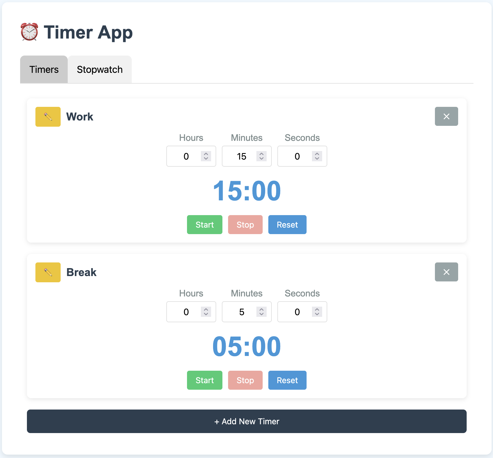
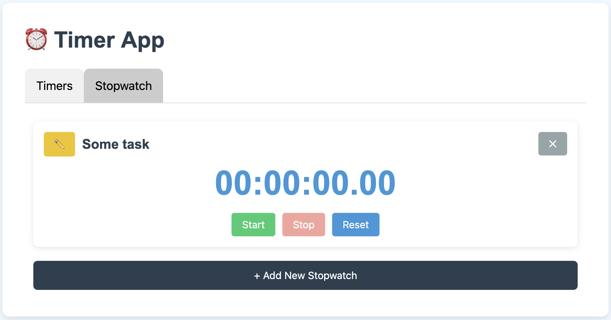

# ⏰ Timer App

This is a stupidly simple timer app. I used Claude to "vibe code" it. Use it if you want, idc. I just wanted to dink around lol.

The app lets you add and delete timers. Rename them. Start / stop them. It saves to `localStorage` and auto-resumes running timers if you reload the page. I've been using it as a Pomodoro timer but it's generic so you don't have to.

Why not just use an existing timer app? Because I'm a weirdo, I guess?

## Screenshots

